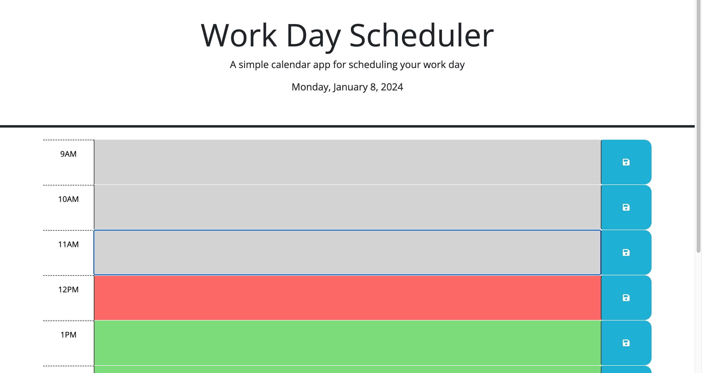
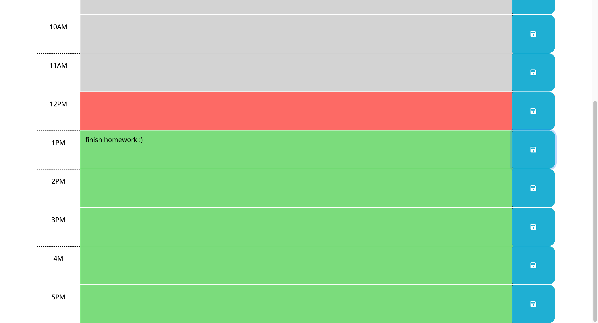

# 5-dayschedulerchallenge

I have modified the starter code for a calendar app that allows a user to save events for each hour of a typical working day. This includes:

- The current date
- Timeblocks color coded in relation to what the current hour is
- Events capable of being saved in local storage

## Tech Used

- The starter code was assigned by Columbia Engineering Coding Boot Camp.
- HTML
- Day.js
- JavaScript and jQuery

## Screenshots

## Deployed Application

[Link to the deployed application]
